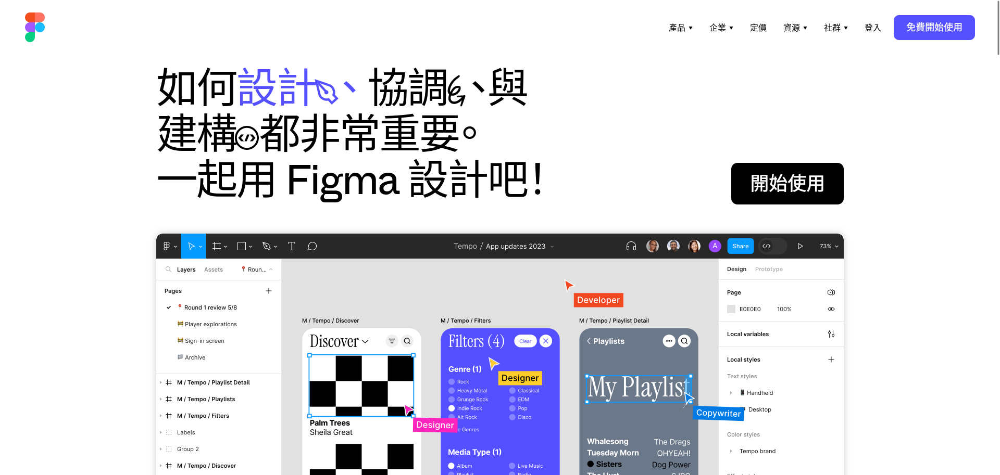
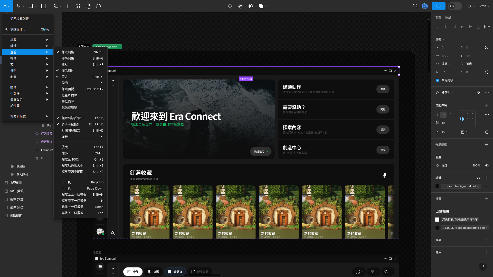

# Figma 繁體中文翻譯

&nbsp;

## 📖 簡介

這是款用於將 Figma 的使用者介面翻譯為繁體中文（台灣）的瀏覽器擴充套件。

不用再為了看不懂英文而煩惱，盡情發揮創意透過 FIgma 設計各種東西吧！

安裝後記得**重新整理 Figma 頁面**翻譯才會生效喔！  
倘若翻譯仍未生效請確認是否有給予本擴充套件足夠的權限，若仍無效歡迎到[這裡](https://github.com/SiongSng/figma-taiwan-translation/discussions)，新增討論串，我會協助您進行排錯。

## 簡易安裝

### Edge 附加元件商店
等待審核中

### Firefox 附加元件站
請在 Firefox 中點擊下方連結，並按下「新增至 Firefox」的藍色按鈕就大功告成啦！  
安裝後記得**重新整理 Figma 頁面**翻譯才會生效喔！  
https://addons.mozilla.org/zh-TW/firefox/addon/figma-taiwan-translation/

## 🖼️ 展示

## 手動安裝
### 基於 Chromium 的瀏覽器（Chrome、Edge）
請先下載擴充套件檔案：[點我下載](https://github.com/SiongSng/figma-taiwan-translation/releases/latest/download/figma-tw-translation-chromium.zip)  

下載完擴充套件檔案後請按照下列步驟手動安裝：  
首先請先將擴充套件檔案解壓縮放在自己找得到的位置，接著點選右上角的漢堡條選單（三個點點的），選擇「更多工具」中的「擴充功能」。

接著在右上角找到「開發者模式」並開啟本功能。

最後點選左上角的載入未封裝項目，選擇剛才解壓縮後的資料夾，就大功告成啦！

### Firefox
請先下載擴充套件檔案：[點我下載](https://github.com/SiongSng/figma-taiwan-translation/releases/latest/download/figma-tw-translation.zip)

下載完擴充套件檔案後請按照下列步驟手動安裝：  
首先請先在上方網址列輸入「about:debugging」，就會看到以下畫面：  

接著點選「這個 Firefox」後選擇「載入暫時用附加元件」

最後選擇剛才所下載的檔案，就大功告成啦！  
提醒您在 Firefox 中手動安裝擴充套件重啟 Firefox 後將會失效，建議您可直接前往 [Firefox 附加元件站](https://addons.mozilla.org/zh-TW/firefox/addon/figma-taiwan-translation/) 下載本擴充套件較為合適。

## 問題回報與翻譯建議
請至本擴充套件的[討論區](https://github.com/SiongSng/figma-taiwan-translation/discussions)新增貼文，並提供相關資訊。

## 🎓 授權條款
The source code of this application is released under the [GNU General Public License v3.0 (GPL-3.0)](https://www.gnu.org/licenses/gpl-3.0.html). For more details, please refer to the [LICENSE](LICENSE) file.

---

本擴充套件是 [figmaCN](https://github.com/Figma-Cool/figmaCN) 的 fork，感謝他們的翻譯與 Content Scripts。  
NOT AN OFFICIAL FIGMA PRODUCT. NOT APPROVED BY OR ASSOCIATED WITH FIGMA.